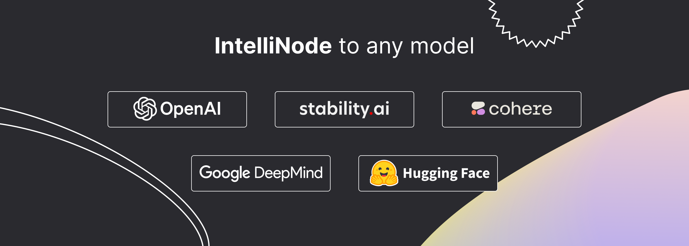

<!-- <p align="center">

</p> -->

<p align="center">

</p>

<h3 align="center">
Unified prompt, evaluation, and production integration to any large model
</h3>

<p align="center">

<a href="https://www.npmjs.com/package/intellinode" alt="npm version">
    
</a>

<a href="https://opensource.org/licenses/Apache-2.0" alt="licenses tag">
    
</a>


<a href="https://discord.gg/VYgCh2p3Ww" alt="Join our Discord community">
    
</a>

</p>

# Intelligent Node

IntelliNode is a javascript module that integrates cutting-edge AI into your project. With its intuitive functions, you can easily feed data to models like **ChatGPT**, **LLaMA**, **WaveNet**, **Gemini** and **Stable diffusion** and receive generated text, speech, or images. It also offers high-level functions such as semantic search, multi-model evaluation, and chatbot capabilities.

# Access the module
## Install
One command and get access to latest models:
```
npm i intellinode
```

For detailed usage instructions, refer to the [documentation](https://docs.intellinode.ai/docs/npm).

## Examples
### Gen
The `Gen` function quickly generates tailored content in one line.<br><br>
import:
```js
const { Gen } = require('intellinode');
```
call:
```js
// one line to generate html page code (openai gpt4 is default)
text = 'a registration page with flat modern theme.'
await Gen.save_html_page(text, folder, file_name, openaiKey);
```
```js
// or generate blog post (using cohere)
const blogPost = await Gen.get_blog_post(prompt, apiKey, provider='cohere');
```

### Chatbot
import:
```js
const { Chatbot, ChatGPTInput } = require('intellinode');
```
call:
```js
// set chatGPT system mode and the user message.
const input = new ChatGPTInput('You are a helpful assistant.');
input.addUserMessage('What is the distance between the Earth and the Moon?');

// get chatGPT responses.
const chatbot = new Chatbot(OPENAI_API_KEY, 'openai');
const responses = await chatbot.chat(input);
```
### Gemini Chatbot
IntelliNode enable effortless swapping between AI models.
1. imports:
```js
const { Chatbot, GeminiInput, SupportedChatModels } = require('intellinode');
```
2. call:
```js
const input = new GeminiInput();
input.addUserMessage('Who painted the Mona Lisa?');

const geminiBot = new Chatbot(apiKey, SupportedChatModels.GEMINI);
const responses = await geminiBot.chat(input);
```

### Nvidia DeepSeek

1. Import:
```js
const { Chatbot, NvidiaInput, SupportedChatModels } = require("intellinode");
```

2. Call:
```js
const input = new NvidiaInput("You are an insightful assistant.", {model: 'deepseek-ai/deepseek-r1'});
input.addUserMessage("What's the summary of the Inception movie?");

// visit build.nvidia.com to get your key.
const nvidiaBot = new Chatbot(NVIDIA_API_KEY, SupportedChatModels.NVIDIA);
const responses = await nvidiaBot.chat(input);
```


The documentation to switch the chatbot between ChatGPT, LLama, Cohere, Mistral and more can be found in the [IntelliNode Wiki](https://github.com/Barqawiz/IntelliNode/wiki/ChatBot).

### Semantic search
import:
```js
const { SemanticSearch } = require('intellinode');
```
call:
```js
const search = new SemanticSearch(apiKey);
// pivotItem is the item to search.
const results = await search.getTopMatches(pivotItem, searchArray, numberOfMatches);
const filteredArray = search.filterTopMatches(results, searchArray)
```

### Prompt engineering
Generate improved prompts using LLMs:
```js
const promptTemp = await Prompt.fromChatGPT("fantasy image with ninja jumping across buildings", openaiApiKey);
console.log(promptTemp.getInput());
```

### Language models
import:
```js
const { RemoteLanguageModel, LanguageModelInput } = require('intellinode');
```
call openai model:
```js
const langModel = new RemoteLanguageModel('openai-key', 'openai');
model_name = 'gpt-4o'

const results = await langModel.generateText(new LanguageModelInput({
  prompt: 'Write a product description for smart plug that works with voice assistant.',
  model: model_name,
  temperature: 0.7
}));

console.log('Generated text:', results[0]);
```
change to call cohere models:

```js
const langModel = new RemoteLanguageModel('cohere-key', 'cohere');
model_name = 'command-xlarge-20221108'
// ... same code
```

### Image models

import:
```js
const { RemoteImageModel, SupportedImageModels, ImageModelInput } = require('intellinode');
```

call DALL·E:
```js
provider=SupportedImageModels.OPENAI;

const imgModel = new RemoteImageModel(apiKey, provider);
const images = await imgModel.generateImages(new ImageModelInput({
    prompt: 'teddy writing a blog in times square',
    numberOfImages: 1
}));
```

change to call Stable Diffusion:
```js
provider=SupportedImageModels.STABILITY;
// ... same code
```

### Openai advanced access
To access Openai services from your Azure account, you have to call the following function at the beginning of your application:
```js
const { ProxyHelper } = require('intellinode');
ProxyHelper.getInstance().setAzureOpenai(resourceName);
```
To access Openai from a proxy for restricted regions:
```js
ProxyHelper.getInstance().setOpenaiProxyValues(openaiProxyJson);
```


For more details and in-depth code, check [the samples](https://github.com/Barqawiz/IntelliNode/tree/main/samples/command_sample).

# Frontend
Include the following CDN script in your HTML:
```
<script src="https://cdn.jsdelivr.net/npm/intellinode@latest/front/intellinode.min.js"></script>
```

Check a sample html [here](https://github.com/Barqawiz/IntelliNode/tree/main/samples/frontend).

# The code repository setup
## First setup
1. Initiate the project:
```
cd IntelliNode
npm install
```

2. Create a .env file with the access keys:<br>
```
OPENAI_API_KEY=<key_value>
COHERE_API_KEY=<key_value>
GOOGLE_API_KEY=<key_value>
STABILITY_API_KEY=<key_value>
HUGGING_API_KEY=<key_value>
```

## Test cases

1. run the remote language models test cases:
`node test/integration/RemoteLanguageModel.test.js`


2. run the remote image models test cases:
`node test/integration/RemoteImageModel.test.js`


3. run the remote speech models test cases:
`node test/integration/RemoteSpeechModel.test.js`

4. run the embedding test cases:
`node test/integration/RemoteEmbedModel.test.js`

5. run the chatBot test cases:
`node test/integration/Chatbot.test.js`

# :closed_book: Documentation
- [IntelliNode Wiki](https://github.com/Barqawiz/IntelliNode/wiki): Check the wiki page for indepeth instructions and practical use cases.
- [Showcase](https://show.intellinode.ai/): Experience the potential of Intellinode in action, and use your keys to generate content and html pages.
- [Samples](https://github.com/Barqawiz/IntelliNode/tree/main/samples/command_sample): Explore a code sample with detailed setup documentation to get started with Intellinode.
- [Model Evaluation](https://www.intellinode.ai/articles/automate-evaluating-language-models): Demonstrate a swift approach to compare the performance of multiple models against designated target answers.
- [Semantic Search](https://github.com/intelligentnode/IntelliNode/wiki/Semantic-Search): In-memory semantic search with iterator over large data.

# Pillars
The module foundation:

- **The wrapper layer** provides low-level access to the latest AI models
- **The controller layer** offers a unified input to any AI model by handling the differences. So you can switch between models like Openai and Cohere without changing the code.
- **The function layer** provides abstract functionality that extends based on the app's use cases. For example, an easy-to-use chatbot or marketing content generation utilities.

# Roadmap
Call for contributors:
[registration form ](https://forms.gle/2JsEHAMaj2eMQHYc9).

- [x] Add support for vllm offline models.
- [x] Add support for Nvidia Nim for local and remote models
- [x] Evaluate multiple models using a few lines.
- [x] Add Gen function to do complex business cases with one command.
- [ ] Audd auto agent capabilities.


# License
Apache License

Copyright 2023 Github.com/Barqawiz/IntelliNode

   Licensed under the Apache License, Version 2.0 (the "License");
   you may not use this file except in compliance with the License.
   You may obtain a copy of the License at

       http://www.apache.org/licenses/LICENSE-2.0

   Unless required by applicable law or agreed to in writing, software
   distributed under the License is distributed on an "AS IS" BASIS,
   WITHOUT WARRANTIES OR CONDITIONS OF ANY KIND, either express or implied.
   See the License for the specific language governing permissions and
   limitations under the License.
