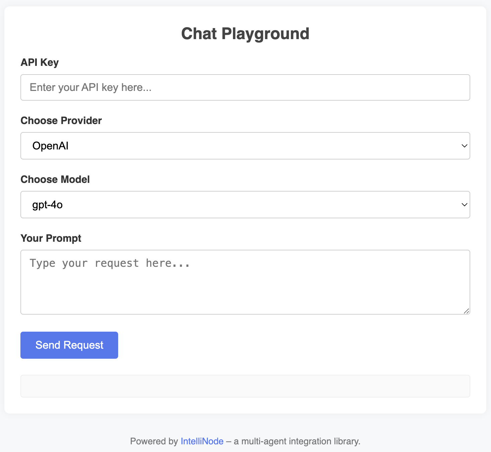

# IntelliNode Frontend

IntelliNode provides a frontend version that runs directly in your browser.




## Running Locally

1. **Start a local server**, for example with Python 3:
`python -m http.server 8000`

2. **Browse** to `http://localhost:8000`.

3. **Enter your API Key**, select the provider, write your prompt, and click **Send Request** 


## Frontend JavaScript

Include the following CDN script in your HTML:
```
<script src="https://cdn.jsdelivr.net/npm/intellinode@latest/front/intellinode.min.js"></script>
```
*Alternative mirror link:*
```
<script src="https://unpkg.com/intellinode@2.2.1/front/intellinode.min.js"></script>
```

# License
Apache License

Copyright 2023 Github.com/Barqawiz/IntelliNode
